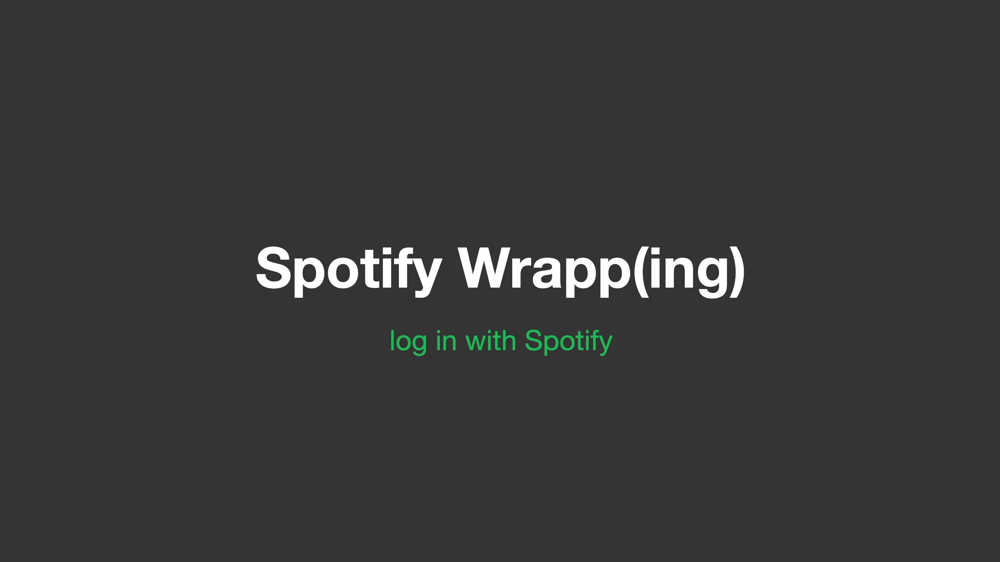

# Spotify Wrapp(ing)

  
This project uses the Spotify API to access a user's listening history and create an in-progress version of Spotify Wrapped's results. Users can now pre-emptively see and fix their Spotify Wrapped before November.
